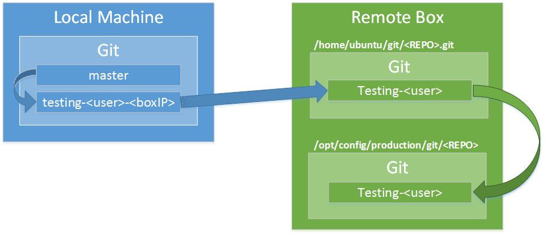

# testbox
This is an automated script to syncronize a *local* **GIT** branch of changes to a *remote* server in order to perform tests.

## Schema

## Usage
The posible options are the following:

* --key: Configures the name to lookup on ~/.ssh
* --repo: Name of the current **GIT** repository configure
* --remote-path: Path to put the working copy of the code on the remote server
* -c, --configure: Sets the connection parameters user@ip and starts the copy
* -s, --send: Sends the commited changes to remote repo and updates the remote path
* -r, --remove: Removes local and remote link and branches created

### Help
    $ testbox.py --help

### Start

    Prerequisites: You should have a key already configured in your .ssh directory:

    $ testbox.py --configure user@ipaddress

### Send changes

    $ testbox.py --send

### Remove link

    $ testbox.py --remove
